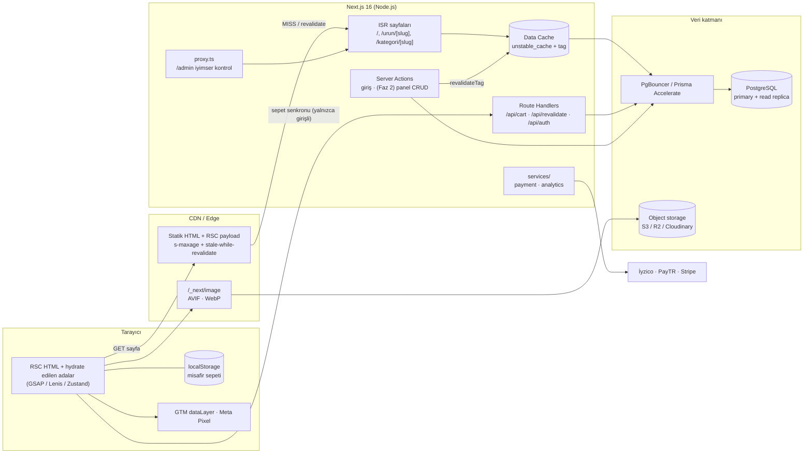
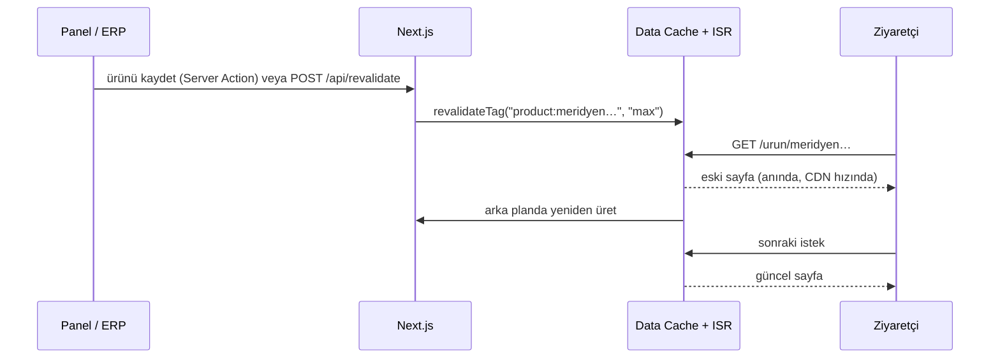
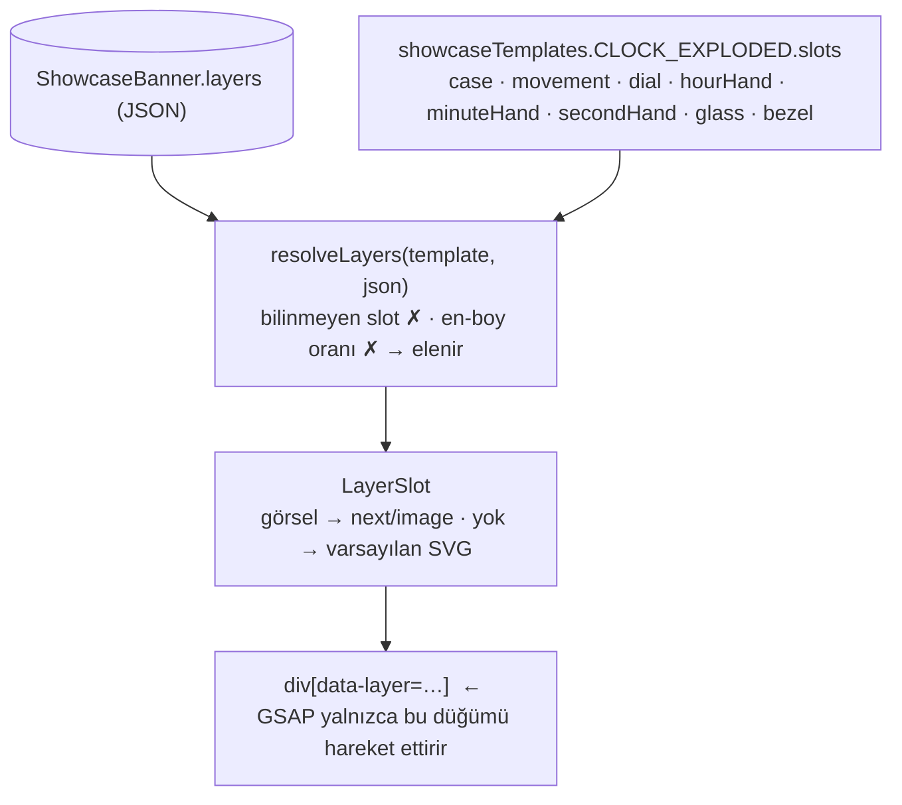
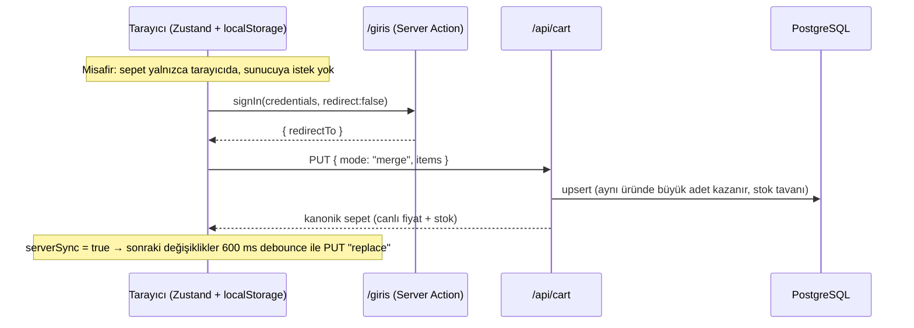
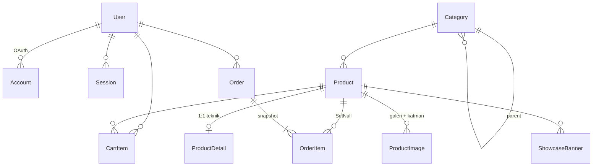

# Mimari

Bu doküman platformun **neden** böyle kurulduğunu anlatır. Kurulum adımları için
[README](../README.md).

## 1. Hedefler ve tasarım ilkeleri

| Hedef                                          | Karar                                                                                                                              |
| ---------------------------------------------- | ---------------------------------------------------------------------------------------------------------------------------------- |
| 100k+ eşzamanlı ziyaretçi                      | Vitrin sayfaları **statik HTML** (SSG + ISR). Trafiğin büyük kısmı CDN'den döner, uygulama sunucusuna ve veritabanına ulaşmaz.     |
| Kişisel veri statikliği bozmasın               | Storefront layout'unda `cookies()` / `auth()` yok. Sepet tarayıcıda (Zustand), oturum yalnızca `/admin`, `/api/cart`, `/giris`'te. |
| 60 FPS mikro etkileşim                         | Yalnızca `transform` + `opacity` animasyonu, tek saat (GSAP ticker) üzerinde Lenis + ScrollTrigger, SVG çizimleri sunucuda render. |
| Panelden içerik değişsin, animasyon kırılmasın | Animasyon **slot**lara bağlı; görsel slotun içeriğidir. Eksik/uyumsuz görsel → varsayılan SVG katmanı.                             |
| Entegrasyonlar sonradan takılabilsin           | `PaymentService` ve `track()` arayüzleri; sağlayıcılar adaptör olarak eklenir, uygulama kodu değişmez.                             |

## 2. Sistem şeması



## 3. Render ve önbellek stratejisi

Next.js 16'da iki model var: **Cache Components** (`"use cache"`) ve **klasik ISR**.
Bu projede klasik ISR seçildi çünkü:

- Vitrin sayfaları tamamen statik HTML olarak üretilir (CDN'e en uygun biçim; PPR'deki
  dinamik "delikler" için sunucu gerekmez).
- `generateStaticParams` boş dönebilir → **veritabanısız `next build`** mümkün (CI). Cache
  Components boş liste kabul etmez.
- Geçiş yolu açık: sorgular zaten `features/*/queries.ts` içinde merkezi; `unstable_cache`
  sarmalayıcıları `"use cache"` + `cacheTag()` ile birebir değiştirilebilir.

| Rota               | Render                 | Zaman bazlı yenileme | Etiketler                                       |
| ------------------ | ---------------------- | -------------------- | ----------------------------------------------- |
| `/`                | Statik (ISR)           | 10 dk                | `showcase`, `catalog`, `categories`, `products` |
| `/urun/[slug]`     | SSG ilk 200 + ISR      | 1 saat               | `product:<slug>`, `products`, `catalog`         |
| `/kategori/[slug]` | SSG + ISR              | 1 saat               | `category:<slug>`, `categories`, `catalog`      |
| `/odeme`           | Statik kabuk + istemci | —                    | —                                               |
| `/admin`, `/giris` | Dinamik (oturum)       | —                    | önbelleksiz                                     |
| `/api/cart`        | Dinamik                | —                    | —                                               |

**Geçersiz kılma akışı** (stale-while-revalidate):



Kural: çalışma zamanında sorgu hatası **yutulmaz** — ISR yenileme başarısız olursa eski
sağlam sayfa servis edilmeye devam eder. Sadece `next build` sırasında veritabanı yoksa
boş veriyle devam edilir (`lib/cache.ts → withBuildFallback`).

## 4. Vitrin (Showcase) slot sözleşmesi



- Pivot, z-derinliği ve zamanlamalar **slot düğümüne** aittir; görsel değişse de değişmez.
- Saat ibreleri gibi dönen parçalar için sözleşme: kare tuval, pivot tam merkezde, ibre 12'yi
  gösterir. Panel bu kuralı `aspectRatio` kontrolüyle zorlar.
- Panel ekranı (Faz 2) aynı `resolveLayers` fonksiyonunu kullanarak hatalı yüklemeyi
  kaydetmeden önce reddeder; genel bakış sayfası bugün bile slot doluluk durumunu gösterir.
- Yeni şablon eklemek: `ShowcaseTemplate` enum'una değer + `templates.ts`'e slot listesi +
  `features/showcase/<şablon>/` altında istemci timeline'ı.

## 5. Animasyon performansı (60 FPS bütçesi)

| Teknik                                                         | Nerede                                   | Neden                                                                                   |
| -------------------------------------------------------------- | ---------------------------------------- | --------------------------------------------------------------------------------------- |
| Yalnızca `transform` / `opacity`                               | Tüm GSAP tween'leri, hover efektleri     | Layout/paint yok; compositor thread'de çalışır.                                         |
| Tek saat: GSAP ticker → `lenis.raf()` → `ScrollTrigger.update` | `components/providers/smooth-scroll.tsx` | Pin/scrub hesapları ile yumuşak scroll aynı karede biter, titreme olmaz.                |
| `scrub: 0.6`, `invalidateOnRefresh`, fonksiyonel değerler      | Saat timeline'ı                          | Ataletli his; yeniden boyutta z-mesafeleri sahne genişliğinden yeniden hesaplanır.      |
| SVG katmanları **sunucu bileşeni**                             | `clock-layers.tsx`                       | İşaretleme HTML'de gelir, istemci JS paketine girmez.                                   |
| Saniye ibresi: bağımsız tween + `IntersectionObserver`         | Saat                                     | Ekran dışında durur, boşa kare üretilmez.                                               |
| DOM'a yazma kısıtlaması                                        | Dijital saat göstergesi                  | Yalnızca dakika değişince `textContent` güncellenir.                                    |
| `gsap.matchMedia()`                                            | Saat, hero                               | `prefers-reduced-motion` → pin yok, statik düzen; kırılımlarda temiz revert.            |
| CSS scroll-driven animations (`animation-timeline: view()`)    | `.reveal` yardımcı sınıfı                | Basit girişler JS'siz, compositor'da; desteklemeyen tarayıcıda öğe olduğu gibi görünür. |
| `backdrop-filter` yok                                          | Sabit header                             | Bulanıklık her scroll karesinde yeniden rasterize ettirir; gradyan bedava.              |
| Başlangıç durumu CSS'te                                        | Adım metinleri, SplitText başlığı        | Hydration öncesi "flash" yok, JS kapalıyken içerik görünür (`<noscript>`).              |

## 6. Sepet ve oturum



- Fiyat **her zaman sunucudan** gelir; istemcinin gönderdiği fiyat hiç okunmaz.
- `skipHydration`: localStorage, hydration bittikten sonra yüklenir → SSR/istemci uyumsuzluğu yok.
- Oturum JWT stratejisinde (Auth.js v5). Proxy yalnızca `/admin/*`'da çalışır ve iyimser
  kontrol yapar; asıl yetki kontrolü `app/admin/layout.tsx` içinde sunucuda tekrarlanır.

## 7. Servis katmanları

**Ödeme** — `services/payment`

```ts
interface PaymentService {
  createPayment(
    input,
  ): Promise<
    { kind: "redirect"; redirectUrl } | { kind: "embedded"; html } | { kind: "completed" }
  >;
  verifyCallback(callback): Promise<{ ok: true; orderId; amountMinor } | { ok: false; reason }>;
  refund(input): Promise<RefundResult>;
}
```

- `PAYMENT_PROVIDER=mock` → `MockPaymentService` (durumsuz, dış istek yok; kuruşu 13 olan
  tutarlar reddedilir — hata senaryosu testi için).
- `iyzico | paytr | stripe` → şimdilik `PendingPaymentService` açık bir hata verir. Canlı
  entegrasyon: aynı arayüzü uygulayan bir sınıf + `index.ts` fabrikasında tek satır.
- `Order.idempotencyKey` (unique) ödeme isteğine taşınır → çift tıklama/yeniden denemede
  mükerrer çekim olmaz.

**İzleme** — `services/analytics`

- Uygulama yalnızca tipli olay üretir: `track("add_to_cart", { … })`.
- Adaptörler: GTM (GA4 e-ticaret şeması), Meta Pixel (standart olaylar), geliştirmede konsol.
- Her olayın `eventId`'si var → ileride sunucu tarafı Conversions API ile tekilleştirme.
- Pixel script'i yüklenmeden üretilen olaylar kuyruğa alınır, init sonrası boşaltılır.
- Script'ler `afterInteractive`; ID tanımlı değilse hiç yüklenmez.

| Olay                | Tetikleyici           | GA4              | Meta               |
| ------------------- | --------------------- | ---------------- | ------------------ |
| `page_view`         | Her rota değişimi     | `page_view`      | `PageView`         |
| `view_content`      | Ürün sayfası          | `view_item`      | `ViewContent`      |
| `add_to_cart`       | "Sepete ekle"         | `add_to_cart`    | `AddToCart`        |
| `initiate_checkout` | Sepette "Ödemeye geç" | `begin_checkout` | `InitiateCheckout` |
| `purchase`          | (Faz 2) ödeme onayı   | `purchase`       | `Purchase`         |

## 8. Veri modeli



- **Para** kuruş cinsinden `Int` (`priceMinor`, `totalMinor`…): yuvarlama hatası yok, JSON'a
  güvenle serileşir.
- **Ölçüler** mm, **ağırlık** gram (`Int`). Esnek teknik tablo `ProductDetail.specs` (JSON,
  Zod ile doğrulanır).
- **OrderItem** ürün adı/SKU/fiyat/KDV snapshot'ı taşır; ürün silinse de sipariş geçmişi bozulmaz.
- İndeksler sorgu desenlerine göre: `(categoryId, status)`, `(status, isFeatured)`,
  `(userId, createdAt)`, `(placement, isActive, sortOrder)`.

## 9. 100k+ eşzamanlılık için üretim notları

1. **CDN önde**: Vercel kullanılıyorsa otomatik. Kendi sunucunuzda (Docker/K8s) Next'in
   ürettiği `Cache-Control: s-maxage…, stale-while-revalidate…` başlıklarını onurlandıran
   bir CDN (Cloudflare, Fastly, CloudFront) koyun.
2. **Çok instance'lı ISR**: Birden fazla Node instance'ı çalıştırıyorsanız ISR/Data Cache
   paylaşılmalı → `next.config.ts` içinde Redis tabanlı `cacheHandler`. Tek instance veya
   Vercel'de gerekmez.
3. **Bağlantı havuzu**: Her instance `DATABASE_POOL_MAX` kadar bağlantı açar. Önüne
   PgBouncer (transaction mode) veya Prisma Accelerate koyun; okuma ağırlıklı sorgular için
   read replica.
4. **Rate limiting**: `/giris` Server Action'ı ve `/api/cart` için IP/kullanıcı bazlı limit
   (ör. Upstash Ratelimit) — Faz 2.
5. **Görseller**: Orijinaller object storage'da; `next/image` AVIF/WebP üretir, 31 gün
   önbellekler. Yüksek trafikte harici bir image CDN loader'ı (Cloudinary/imgix) tercih edin.
6. **Ödeme webhook'ları**: Sağlayıcı callback'leri kuyruğa (SQS/Redis) alıp idempotent
   işleyin; `Order.idempotencyKey` + `paymentReference` unique kontrolü.
7. **Gözlemlenebilirlik**: `instrumentation.ts` + OpenTelemetry; Prisma `comments` ile
   sorgu etiketleri.

## 10. Klasör yapısı

```
src/
├─ app/                          # Yalnızca rotalar (ince katman)
│  ├─ (storefront)/              # Statik vitrin kabuğu (header, footer, sepet)
│  │  ├─ page.tsx                # Ana sayfa · ISR 10 dk
│  │  ├─ urun/[slug]/            # Ürün detayı · SSG + ISR · JSON-LD
│  │  ├─ kategori/[slug]/
│  │  └─ odeme/                  # Faz 2'de PaymentService'e bağlanacak
│  ├─ (auth)/giris/
│  ├─ admin/                     # Dinamik, rol korumalı panel
│  └─ api/                       # auth · cart · revalidate
├─ features/                     # Alan (domain) modülleri — UI + sorgu + şema bir arada
│  ├─ showcase/                  # Slot sözleşmesi, sorgu, LayerSlot
│  │  └─ clock/                  # Saat SVG katmanları + GSAP timeline
│  ├─ catalog/                   # DTO'lar, önbellekli sorgular, kart/medya
│  ├─ cart/                      # Zustand store, senkron, sepet UI
│  ├─ auth/  admin/  home/  checkout/
├─ services/                     # Dış dünyaya açılan kapılar (adaptör deseni)
│  ├─ payment/                   # PaymentService + mock + sağlayıcı iskeletleri
│  └─ analytics/                 # track() + GTM/Meta adaptörleri + script'ler
├─ components/
│  ├─ ui/                        # shadcn/ui (new-york)
│  ├─ layout/  providers/
├─ lib/                          # db, cache, gsap, money, utils
├─ config/site.ts                # Marka adı, URL, para birimi
├─ generated/prisma/             # `prisma generate` çıktısı (git'e girmez)
├─ auth.ts  auth.config.ts  proxy.ts
prisma/
├─ schema.prisma  seed.ts  migrations/
prisma.config.ts                 # Prisma 7: bağlantı adresi ve seed komutu burada
```

## 11. Yol haritası

- **Faz 2** — Panel CRUD (ürün formu: ölçü/ağırlık/teknik tablo/çoklu galeri/stok-fiyat,
  sipariş yönetimi, vitrin slot yükleyici, banner takvimi), checkout + mock ödeme akışı,
  rate limiting, KVKK onay yöneticisi (Consent Mode v2).
- **Faz 3** — İyzico/PayTR/Stripe canlı POS, Meta Conversions API, kargo entegrasyonu,
  diğer vitrin şablonları (`CABINET_REVEAL`, `LAYER_STACK`, `BOOKMARK_FLIP`).
- **Faz 4** — Arama (Meilisearch/Typesense), çoklu dil/para birimi, Cache Components'a geçiş.
